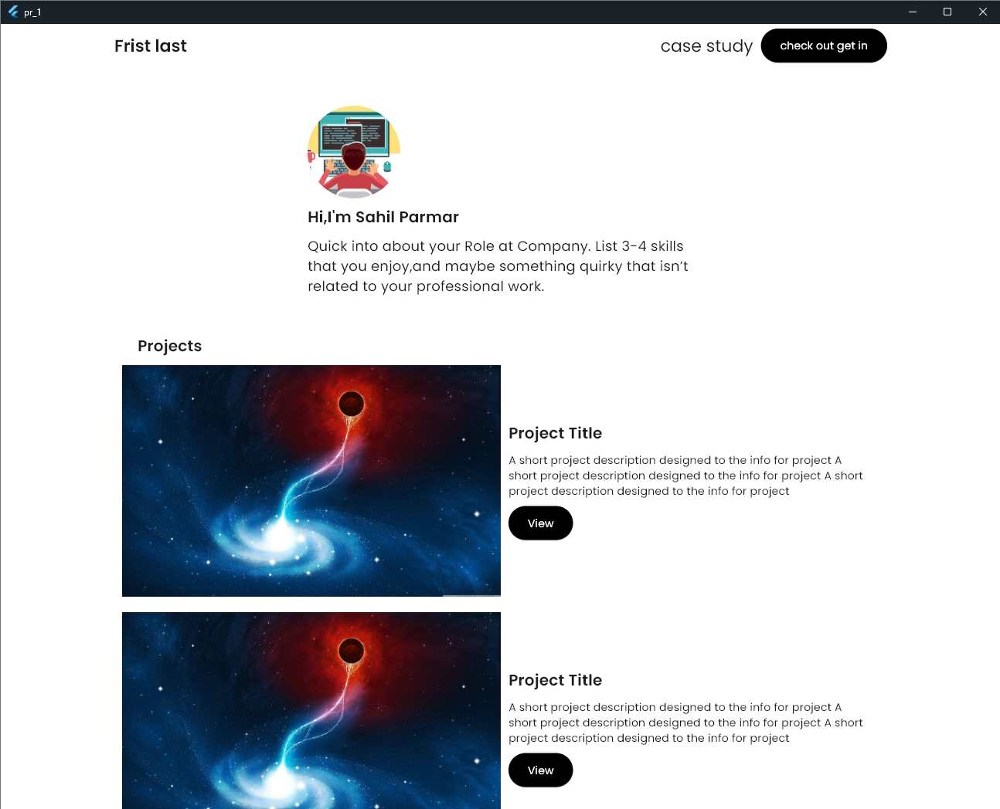
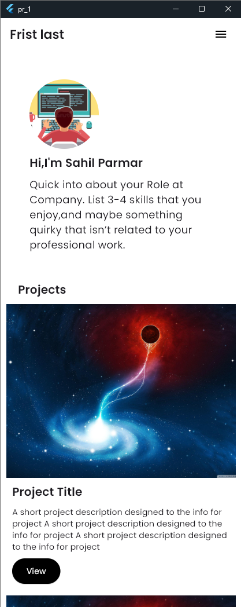
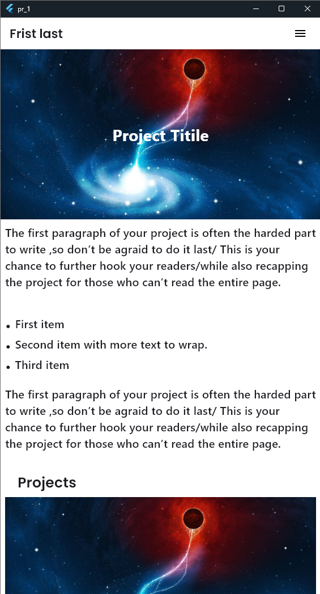

# Flutter Portfolio Template

This project is a **practice-based portfolio template** built using **Flutter**. The design was first created in **Figma** and then converted into a responsive Flutter UI.

---

## 📌 About the Project

- 🎨 Designed the UI template in **Figma**
- 💻 Converted the design into **Flutter code**
- 📱 Practiced **responsive design** to ensure the layout looks good on various screen sizes (mobile, tablet, web, and desktop)
- 🖼️ Used **predefined/static text and images** as placeholder content (not dynamic)

This project was built for **UI development practice only**, and it does **not include backend or user input functionality**.

---

## 💡 Key Features

- Clean and modern UI
- Fully responsive layout using `LayoutBuilder`, `MediaQuery`, and flexible Flutter widgets
- Cross-platform support (Web, Windows, Android)
- No business logic – purely a static UI template

---

## 📷 Screenshots

| Desktop View                                          | Mobile View                                         |
|-------------------------------------------------------|-----------------------------------------------------|
|  |  |



---

## 🚀 Getting Started

1. Clone this repository:
   ```bash
   git clone https://github.com/sahil-Parmar1/portfolio_website.git
